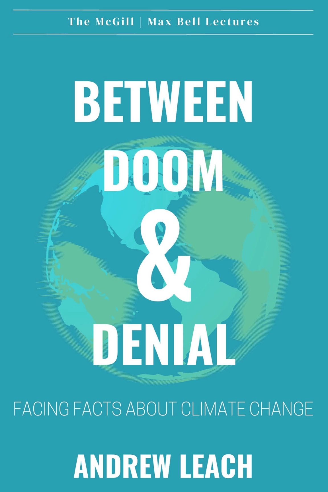

---
## Configure page content in wide column
title: "Between Doom and Denial" # leave blank to exclude
number_featured: 1 # pulling from mainSections in config.toml
use_featured: false # if false, use most recent by date
number_categories: 3 # set to zero to exclude
links:
- icon: door-open
  icon_pack: fas
  name: Click here to buy!
  url: https://sutherlandhousebooks.com/product/between-doom-denial/
---

</head>
<body>

Climate change is the environmental, political, and societal challenge of our time. Yet some of us throw up our hands and say Canada is a cold country that only produces 2 percent of global emissions and we need our oil-and-gas industry—nothing can or should be done. Others argue just as vehemently that we are doomed unless we radically reduce emissions, keep our resources in the ground, and turn our backs on economic growth. Meanwhile our governments promise a rapid energy transition with nobody left behind. The truth is that we do have a climate change problem, we will continue to use fossil fuels (at least for the foreseeable future), we are already seeing dramatic changes in our energy systems, and some people inevitably will be left behind. We have the tools to make a real difference, argues Andrew Leach in the inaugural McGill/Max Bell Lecture, but big questions remain. Are we up to the challenge? And can we be honest with ourselves about what the energy transition really means for Canada?

Published by Sutherland House, October 2023 

