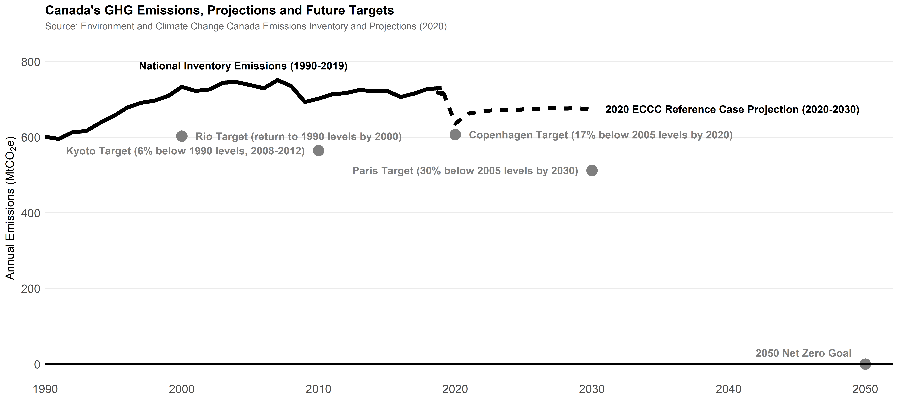

Matching the U.S. on emissions reduction targets rather than policies has proved to be the undoing of many a Canadian prime minister when it comes to climate change. Prime Minister Justin Trudeau must understand why before his appearance at this week's U.S. climate summit.

The fundamental problem with agreeing to reduce our emissions by the same percentage as the U.S. relative to some historic year (say, 50 per cent below 2005 levels by 2030) is that we'd require more stringent policies to reach that outcome. Since we don't want policies too far out-of-step with those of our largest trading partner, we'll end up not meeting our targets.

To solve this problem, we should align on policies, not targets.

-   [**Canada's new climate change target will exceed 40% cut in emissions: Radio-Canada sources**](https://www.cbc.ca/news/politics/ghg-emissions-target-reductions-1.5996400)

This is a problem as old as international climate change agreements. As our negotiators arrived in Kyoto in December 1997 to hammer out the details of the Kyoto Protocol, the first major international climate change agreement, Prime Minister Jean Chrétien updated their marching orders: Canada's commitment should exceed whatever the Americans proposed, despite what had been developed through a national, consultative process in the lead-up to the conference. 

Canada committed to reduce emissions by six per cent below 1990 levels, on average, during the 2008-2012 period. We would never even get close to meeting that target, as shown on the graph below, in part because we'd set ourselves up for failure. The policies to get there were too much for Prime Minister Chrétien's government to stomach.

Despite the failure of Kyoto, this modus operandi of matching the Americanshas remained in place for more than two decades. It was repeated in setting our 2020 target at Copenhagen and in setting our 2030 target by Prime Ministers Harper and Trudeau. It looks like we're preparing to write another chapter in this tired story today as Trudeau takes part in the first U.S. climate summit since the election of President Joe Biden.

Some context. U.S. greenhouse gas (GHG) emissions were 7,423 megatonnes of carbon dioxide equivalent (Mt CO2e) in 2005 and peaked in 2007 at 7,449 Mt CO2e. Since then, emissions have been on a steady decline despite only moderate emissions reduction policies in place. By 2019, the most recent data available, U.S. emissions were 12 per cent below 2005 levels and they are expected to continue declining even without any new policies. 

In Canada, our emissions in 2005 were 739 Mt CO2e, and by 2019 our emissions had decreased only modestly to 730 Mt CO2e, having peaked in 2007. Tellingly, despite policies including national carbon pricing imposed by the government of Justin Trudeau, emissions in 2019 were the highest we'd seen since 2008. While the pandemic will lead to a big emissions decrease in 2020, Environment Canada projected in 2020 that emissions would grow modestly between 2021 and 2030 with no new policies.

Why the difference in trends and policy responsiveness? Oil and gas and (mostly) electricity. These two sectors make up about 99 per cent of Trudeau's problems going into the summit.

U.S. electricity sector emissions dropped by almost 35 per cent between 2005 and 2019, but on average each megawatt-hour produced still generates 0.417 tonnes of GHGs. This remarkable outcome was driven by a transition away from coal generation (down more than 50 per cent since 2005) and toward gas (up 108 per cent since 2005), with more modest increases in emissions-free sources (up 35 per cent since 2005). But the fact that electricity in the U.S. remains quite emissions-intensive means the U.S. can get many more emissions reductions from electricity at relatively low (or even negative) costs.

Compare that to Canada. Over the same period of 2005 through 2019, Canadian electricity generation rose by five per cent, with an impressive 45 per cent drop in emissions. But here's where the road gets tough: 83 per cent of 2019 generation in Canada came from emissions-free sources. The emissions-intensity of utility power generation in Canada is a little over 0.1 tonnes of CO2 per MWh, about four times smaller than that of the U.S. We're in a completely different place without a lot of easy room for improvement.

Prime Minister Jean Chretien hands over Canada's instrument of ratification for the Kyoto Protocol to Environment Minister David Anderson during a ceremony on Parliament Hill in December 2002. The country would never even get close to meeting the Kyoto targets. (Fred Chartrand/The Canadian Press)

What about oil and gas? Unfortunately, the U.S. emissions inventory data does not report a separate category for upstream oil and gas emissions. (While we're here, that might be a small request for Prime Minister Trudeau to make of the Biden administration.) However, we know that U.S. oil and gas production has increased rapidly, with oil production more than doubling from 2005 to 2019 and gas production increasing almost 75 per cent over the same period.

In Canada, oil production has increased a bit more slowly, nearly doubling since 2005, but natural gas production is down about 10 per cent over that period.

The emissions elephant in the room remains the oilsands.

Emissions from oil and gas extraction overall are up 66 per cent in Canada since 2005, driven by an accelerating shift toward production of higher-emissions oilsands. In the U.S., production has shifted away from emissions-intensive thermal production to lower-emissions light-tight oil.

Whatever Canada's government commits to in terms of emissions reductions must translate directly to changes in the oilsands sector or our commitments aren't credible.

Now, let's talk about policies.

The signature piece of Prime Minister Trudeau's national climate change policy is the Greenhouse Gas Pollution Pricing Act (GGPPA), recently upheld by the Supreme Court. This policy imposes a national carbon price, with delegation to the provinces as appropriate, and will see our national carbon price increase to $50 per tonne next year.

What's more, every major political party in Canada supports carbon pricing approaching at least that level of stringency.

Prime Minister Trudeau has already committed to increasing that price to $170 per tonne by 2030. We also have a regulated coal-power phase out by 2030, a national clean fuel standard, and myriad provincial policies pushing emissions down. The U.S. has none of these things in place today. Not even close.

Modelling released today by [Canadian environmental groups](https://environmentaldefence.ca/report/fair_share_canada_model/) gives you an idea of what would have to change to meet more stringent targets.

To reach a 60 per cent reduction relative to 2005 levels by 2030, more stringent than the 50 per cent request President Biden is rumoured to be making to the prime minister, the current plan to increase national carbon prices from $40 per tonne today to $170 per tonne by 2030 would not cut it. Rather, carbon prices would have to increase to double or even triple that level, and be complemented with a suite of stringent regulatory measures to close the gap.

New modelling gives an idea of what would have to change to meet targets slightly more stringent than the ones President Biden is rumoured to be asking for. Oil and gas production would drop by 79 per cent in the next eight years, with no oilsands upgrading or in-situ production at all by 2030. (Jeff McIntosh/The Canadian Press)

Had they modelled a 50 per cent reduction from 2005 levels by 2030, I doubt that would change the overall conclusion very much. 

Want to know what such policies would look like closer to home here in Alberta? The [report](https://environmentaldefence.ca/report/fair_share_canada_model/) projects that, on what they call a "Fair Share" path, oil and gas production would drop by 79 per cent in the next eight years, with no oilsands upgrading or in-situ production at all by 2030. Smaller declines would be seen if oil prices remain higher.

Of course specific outcomes are speculative, but targeting anything like a 50 per cent reduction by 2030 would certainly represent a government-induced economic upheaval unlike any other in Canada's history.

How does this compare to the U.S.? The Americans can get much further with much less stringent policies.

A policy like the GGPPA, which imposed a national carbon price of $50 per tonne, increasing at one per cent above inflation was projected in a recent [Brookings Institute report](https://www.brookings.edu/wp-content/uploads/2019/05/ES_20190507_Morris_CarbonPricing.pdf) to be likely to generate emissions reductions in line with the U.S. Paris target. Recall that, for us to reach those kinds of reductions, we've committed to increasing national carbon pricing from $50 per tonne next year to $170 per tonne in 2030.

Committing to the same targets as the U.S. will mean that we have radically different policies from our largest trading partner with substantial consequences for some of our key industries. 

Canada should learn the lessons of the past and commit to targets which correspond to our policy ambition and our national circumstances.

We should encourage others to follow our policies. In fact, recent analysis by the International Monetary Fund (IMF) shows that if the G20 adopted even half of the incremental carbon pricing policies that Canada has committed to under the GGPPA, they'd nearly triple their emissions reduction pledges under the Paris accord. That's right -- with a $75 per tonne carbon price across the G20, we'd see emissions reductions of nearly 35 per cent below business-as-usual levels, while the collective Paris pledges of G20 nations amount to less than 15 per cent below business-as-usual.

The world needs new and better policies, not target bingo.

I would welcome a pledge by President Biden to a [clean electricity standard](https://collaborative.evergreenaction.com/policy-hub/100-clean), even if that would only see the U.S. achieve current Canadian levels of clean generation by 2030. I would welcome a national U.S. carbon price, even if it didn't meet the levels currently projected in Canada. I would welcome a U.S. coal-power phase out by 2030, even if it included limited exemptions like those in the Canadian policy. 

But we must not go down the same path of committing to match U.S. emissions reductions relative to the year in which U.S. emissions were near their peak, unless we're prepared to have far more stringent policies than our largest trading partner for the foreseeable future. 

Prime Minister Trudeau should welcome President Biden to join him in leading on policies that matter, and should also welcome a U.S. push to bring other countries along. He should not allow us to be bullied because we didn't have the wisdom to burn a lot more coal for electricity in 2005, or because we didn't expand the oilsands more rapidly prior to that date.